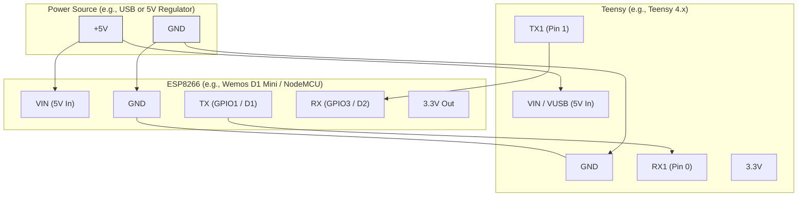

# Vybes, a home DSP project

Vybes is a DSP, designed for flexibility and multiple presets for room correction, EQ curve preferences, dynamic EQ adjustments based on volume, phase syncing, and subwoofer crossover, all controlled via a web interface over WIFI.

## Internals
At the core of the device is a Teensy 4.0 with a 600MHz processor. The Teensy is responsible for all the digital audio manipulations, including delays and parametric EQ.

An ESP8266 NodeMCU development board is responsible for connecting to WIFI, serving a web UI and API, and managing Teensy state. The ESP8266 flash memory will be used to remember preset configurations and for serving up assets for the web UI.

An SPDIF Toslink optical input with digital I2S output allows for direct digital audio into the Teensy without losing audio quality converting from analogue.

Output consists of four RCAs connected to two PCM5102A DAC boards. Two will be used for L & R channels, and one will be used as a subwoofer output. The fourth will be connected, but not used at this point. It could be used for a second subwoofer st some point in the future.

To ensure a smooth power supply, a linear regulator will take a 5V input from a standard power supply via USB-C and output a stable 3.3V that can be used by the DACs.

An internal microphone (ICS-43434 with digital I2S output) connected to the Teensy can detect room volume levels so that EQ can be adjusted dynamically.

A 1602A backlit LCD screen will show the current preset name. The backlight turns on when the preset changes, and turns off after 5 seconds of inactivity.

A button on the front will allow changing between presets and if held for more than 5 seconds, will put the device into config portal state so it can be connected to by an iPhone and authentication details provided for the local network. The ESP8266 will then register itself on the network using MDSN so that it can be accessed on http://vybes.local. (see https://github.com/tzapu/WiFiManager)

## System Architecture
The system consists of three main components:
- **ESP8266 Microcontroller**: Acts as the central hub. It hosts the web interface, communicates with the Teensy to send control parameters and receive data, and serves the Web UI to the user's browser.
- **Teensy Microcontroller**: Responsible for real-time audio processing. It receives EQ parameters from the ESP8266, applies them to the audio signal, and can send processed data or status back.
- **Web User Interface (WebUI)**: A Vue 3 single-page application running in the user's browser. It provides controls for the parametric EQ, sending user adjustments to the ESP8266, which then relays them to the Teensy. The UI is designed to be lightweight to be served from the ESP8266.

## Hardware Wiring Diagram
This section describes the physical wiring between the ESP8266 and the Teensy microcontroller.

**Power Connections:**
- **ESP8266 VIN** to **Teensy VIN/VUSB**: Provides power to the Teensy from the ESP8266's regulated output if available, or share a common 5V source. Ensure voltage compatibility.
- **ESP8266 GND** to **Teensy GND**: Essential common ground connection.

**Serial Communication (Logic Level 3.3V):**
- **ESP8266 TX (GPIO1 or D1 on Wemos D1 Mini)** to **Teensy RX (e.g., Pin 0 on Teensy 4.x - Serial1 RX1)**: Transmits data from ESP8266 to Teensy.
- **ESP8266 RX (GPIO3 or D2 on Wemos D1 Mini)** to **Teensy TX (e.g., Pin 1 on Teensy 4.x - Serial1 TX1)**: Transmits data from Teensy to ESP8266.

*Important Notes:*
- *Logic Levels*: Both ESP8266 and most Teensy boards operate at 3.3V logic levels. Direct connection for serial communication is usually fine. Verify for your specific Teensy model.
- *Serial Port*: The pins mentioned for ESP8266 (GPIO1, GPIO3) are typically used for `Serial`. For Teensy, `Serial1` (Pins 0 and 1) is a common choice for communication with other devices. Adjust pins if using different serial ports.
- *Alternative Power*: If the ESP8266 cannot provide sufficient power, power the Teensy separately via its USB port or VIN pin, but ensure a common ground is always maintained.

## Data Structure for presets
* Preset name
* Speaker delays
  * Left
  * Right
  * Sub
* Subwoofer crossover
  * Frequency
  * Slope (12db, 24db)
* Room Correction: Array of PEQ sets, where each set contains:
  * SPL value (can be null)
  * PEQ set: Array of PEQ points, where each point contains:
    *  Frequency
    *  Gain
    *  Q
*  Preference Curve: Same as Room Correction, can be copied from presets like "Harmon"
*  Equal loudness (on/off)

## Web UI Pages
### Calibrate
This page shows if no calibration has been completed. It must be done before any presets are configured. It contains an input for entering an SPL value and a button to toggle pink noise.

### Home
This page allows the user to quickly perform actions using buttons, sliders and switches. Each top level bullet point is contained in its own box to show a relation between inputs.

* Presets: a button for each, and a plus icon to add new.
  * Current preset button shows in an active state. When in an active state, the preset shows icons on the right:
    * edit: when tapped, navigates to the preset configuration page
    * copy: when tapped, creates a new preset with all settings copied across from the active preset. The new preset name is the same, but with " Copy" appended. The new preset becomes the active preset.
* Turn on/off the subwoofer output (switch)
* Bypass DSP (switch)
* Mute
  * Percentage (slider)
  * On/off (switch)
* Calibration value (text)
* Tools (button, opens tools page)

### Tools
This page is for utilities that don't belong to a specific preset but can be useful.

* Tone generator
  * Frequency slider
  * Volume slider
  * Text value of current frequency  
* Pink noise generator toggle button

### Preset configuration
This page is for editing the properties of an individual preset.

* Name: input, saves immediately on blur
* Speaker delays:
  * Inputs for each speaker, in ms
  * Auto: button, helps to calculate speaker distances and group delay by playing a 100hz pulse for 200ms on each output (L, R, sub), with a 300ms silence inbetween. The pulses can be recorded from the iPhone mic at the listening position and measurements can be taken to determine appropriate speaker delay values, which can then be populated into the speaker inputs
* Room correction: shows a list of PEQ sets, where each list item shows the SPL value for the set, and a small chart showing a preview of the EQ curve
  * Tapping on a list item expands it, showing:
    * An input to edit the SPL value. Changing the SPL value results in the existing set being deleted and a new one created for this SPL. An SPL cannot be chosen that already exists in the list.
    * An interactive PEQ chart, with a tappable circle for each point, and an overall calculated curve. The chart shows a plus icon in the top right corner that allows another point to be added.
    * Freq: slider & input, to adjust value for selected point
    * Gain: slider & input, to adjust value for selected point
    * Q: slider & input, to adjust value for selected point
* Preference curve: same interface as room correction
* Equal loudness: switch
 
## API Endpoints
* PUT /calibrate/{spl}
  * spl: 40-120 The SPL measured at the listening position. When saved, it is saved with the corresponding SPL measured from the internal mic.
* PUT /sub/{state}
  * state: "on" or "off"
* PUT /bypass/{state}
  * state: "on" or "off"
* PUT /mute/{state}
  * state: "on" or "off"
* PUT /mute/percent/{percent}
  * percent: 1-100
* PUT /generate/tone/{freq}/{volume}
  * freq: 10-20k
  * volume: 1-100
* PUT /generate/noise/{volume}
  * volume: 0-100 A zero value turns off the noise
* PUT /pulse
  * Plays a 100hz pulse for 200ms on each output, with a 300ms silence inbetween
* PUT /preset/rename/{name}/{new}
  * name: string matching existing preset
  * new: new preset name
* POST /preset/create/{name}
  * name: string not matching existing preset
* POST /preset/copy/{name}/{new}
  * name: string matching existing preset
  * new: new preset name
* DEL /preset/{name}
  * name: string matching existing preset
* PUT /preset/delay/{speaker}/{ms}
  * speaker: "left", "right", "sub"
  * ms: float, millisecond value
* POST /preset/{name}/eq/{type}/{spl}
  * type: "room" or "pref"
  * name: string matching existing preset
  * spl: 0-120
  * body: JSON representation of PEQ set
* DEL /preset/{name}/eq/{type}/{spl}
  * type: "room" or "pref"
  * name: string matching existing preset
  * spl: 0-120 matching existing spl for this preset
* PUT /preset/{name}/crossover/{freq}/slope
  * name: string matching existing preset
  * freq: 40-150
  * slope: "12" or "24"
* PUT /preset/{name}/equal-loudness/{state}
  * name: string matching existing preset
  * state: "on" or "off"
* GET /presets
  * Returns a JSON array of presets, where each preset object contains
    * name
    * isCurrent: bool
* GET /preset/{name}
  * Returns JSON of all preset data
* SOCKET /live-updates
  * Messages to be received are JSON format with the following properties:
    * event: "rta", "preset", "eq"
